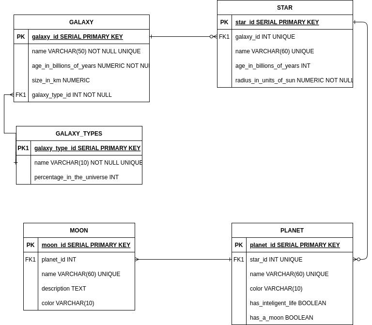

# CELESTIAL BODIES DATABASE PROJECT 
## freecodecamp project

This is a database created with postgress.

**Instructions**

1. Download file universe.sql.
2. Install a posgress.
3. Run in terminal the following command to install database:
> **$ psql -U postgres < universe.sql**

## The following image shows the entity-relationship model.

## Queries to show some table relations

### Display all start foreach galaxy 
> **SELECT star.name,galaxy.name FROM star JOIN galaxy ON star.galaxy_id = galaxy.galaxy_id;**

### Display all planets foreach star
> **SELECT star.name,planet.name,planet.has_a_inteligent_life,planet.has_a_moon FROM star JOIN planet ON star.star_id = plane
t.star_id;**

### Display all moons foreach planet
> **SELECT planet.name,moon.name,moon.description,moon.color FROM moon JOIN planet ON moon.planet_id = planet.planet_id;**

### Display all galaxy and his type
> **SELECT galaxy.name,galaxy_type.name FROM galaxy JOIN galaxy_type ON galaxy.galaxy_type_id = galaxy_type.galaxy_type_id;**

