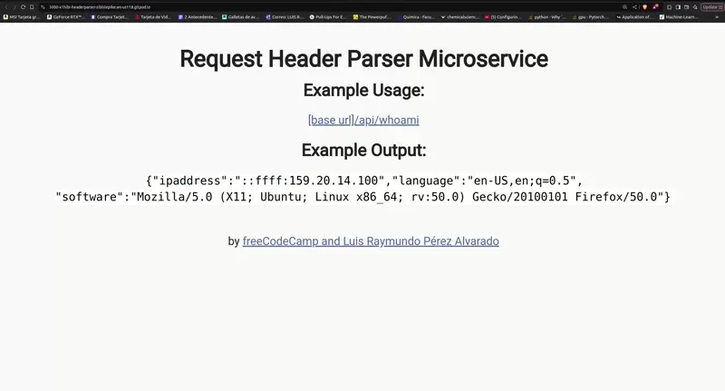

# Request Header Parser Microservice

This is a Request Header Parser Microservice project for freecodecamp certification.

To use this microservice clone this repo

```bash
$ git clone https://github.com/x1hibi/x1hibi.git
```
Go to the folder of selected project 

```bash
$ cd x1hibi/projects/requestHeaderParser
```
Install node modules and start service

```bash
$ npm i
```
Run microservice
```bash
$ npm run start
```

## Convert miliseconds in date UTC
