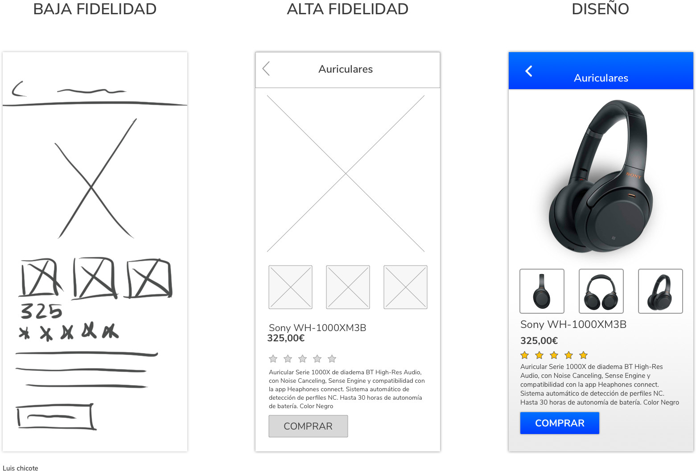

# Temas y habilidades

## Diseño

### Wireframes

Es un boceto (representa esqueleto) de una pagina web o de las pantallas de una apliación, carece de color, tipografias y aplicaciones graficas, sirve para mostrar las funcionalidades, comportamiento y jerarquias de los contenidos en la página. [by balsmic "wireframe is a SIMPLE sketch of user interface"]

- Diseño de la información (como va ir estructurada la información para que entienda la información de la mejor manera posible)
- Diseño de la navegación (como estaran conectados los diferentes wireframes dependiendo del contenido y donde se hace click)
- Diseño de la interfaz de usuario (como se distribullen los elementos [cuadros de texto, imagenes, barras laterasles, de navegación, botones, links, etc])

Existen tres tipos de baja fidelidad (just box and text like rayones) y alta fidelidad (cute box, elemnets and text).

wireflow-> Este es el flujo que se da o puede dar entre wireframes al dar click sobre algun elemento clicleable.

### Mockup

Es una imagen visual que muestra el resultado de la pagina web (maqueta web), esta a diferencia del wireframe, tiene tipografias, sombras, imagenes, colores, literal es el diseño final de la web.

